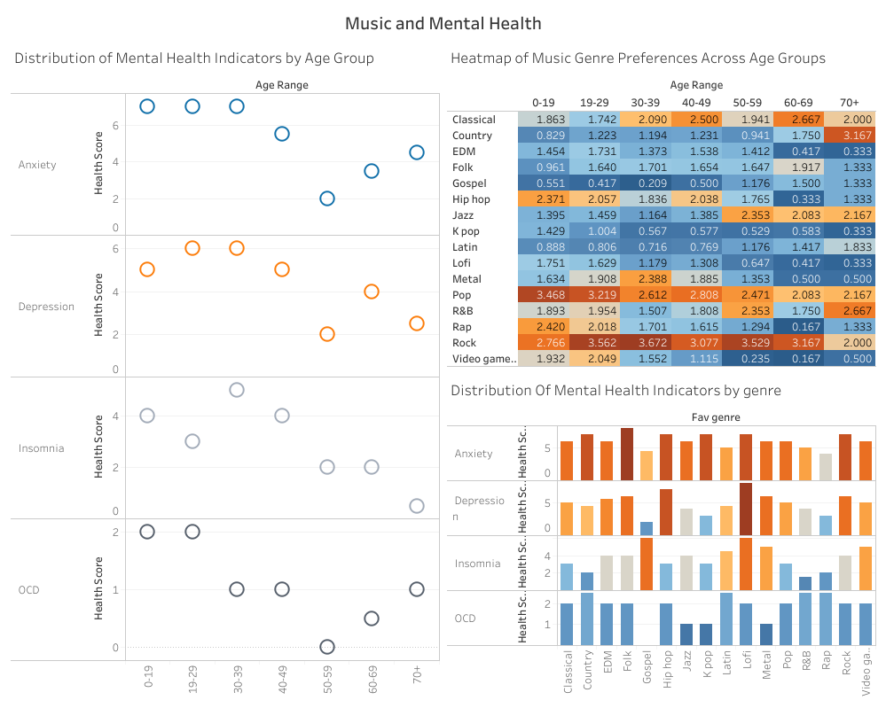
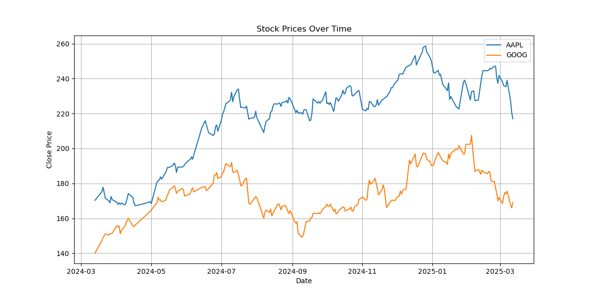

# Welcome to Lolita's Data Analysis Portfolio! 👋

Hello! I'm Lolita, a data analyst passionate about uncovering hidden patterns and turning data into actionable insights. I believe in the ability of data to reveal hidden stories within lines and rows, turning abstract information into concrete understanding.

### About me

While my career began in front-end engineering. I've always been drawn to the power of data. My recent experience in the healthcare industry, working with SQL databases for a year, solidified this passion and provided practical skills in data management and querying.

To further deepen my knowledge, I completed the Google Data Analytics Professional Certificate, which equipped me with a comprehensive understanding of data analysis tools and techniques. 

## Featured Projects

### 🎵 Music and 🧠 Mental Health Analysis

* **Description:** This project investigates the relationship between music preferences and mental well-being. Using a dataset from Kaggle, I explored correlations between preferred music genres, listening habits, and mental health indicators such as anxiety, depression, insomnia, and OCD. The analysis involved data cleaning in Excel, SQL analysis in BigQuery, and data visualization in Tableau to identify potential associations and trends.
* **Technologies Used:** Excel, SQL (BigQuery), Tableau
* **Link:** [Music and Mental Health analysis](https://github.com/Lolitosss/data-analyst-portfolio/tree/main/music-and-mental-health-analysis)
* **Visualizations:** 

### 📈 Stock Market Analysis

* **Description:** This project analyzes the historical stock performance of user-specified tickers, focusing on daily returns, volatility, and cumulative returns. Using data from Yahoo Finance (yfinance), I implemented a Python script to download, clean, and analyze stock data, providing insights for potential investment considerations. The analysis includes visualizations of adjusted close prices, daily returns, cumulative returns, and volatility.
* **Technologies Used:** Python, Pandas, yfinance, Matplotlib
* **Link:** [Stock Market Analysis](https://github.com/Lolitosss/data-analyst-portfolio/tree/main/stock-data-analysis)
* **Visualizations:** 

### 📦 TheLook E-Commerce SQL Analysis

* **Description:** This project explores the **TheLook E-Commerce** dataset using SQL to analyze **sales trends, customer behavior, and product performance**. The analysis involved data cleaning, complex JOIN operations, aggregations, and window functions to uncover key business insights, such as top-performing products, customer segments, and revenue trends. The project emphasizes SQL proficiency in handling large datasets and generating actionable insights.  
* **Technologies Used:** SQL, BigQuery  
* **Link:** [TheLook E-Commerce SQL Analysis](https://github.com/Lolitosss/data-analyst-portfolio/tree/main/thelook-e-commerce-sql-analysis)  

Furthermore, I'm deeply interested in continuing to develop my Business Intelligence (BI) skills and deepen my overall knowledge as a data analyst.

## Connect with Me

**Tech Stack:**

   

Feel free to explore my repositories and reach out if you have any questions or work opportunities and constructive critics:)
