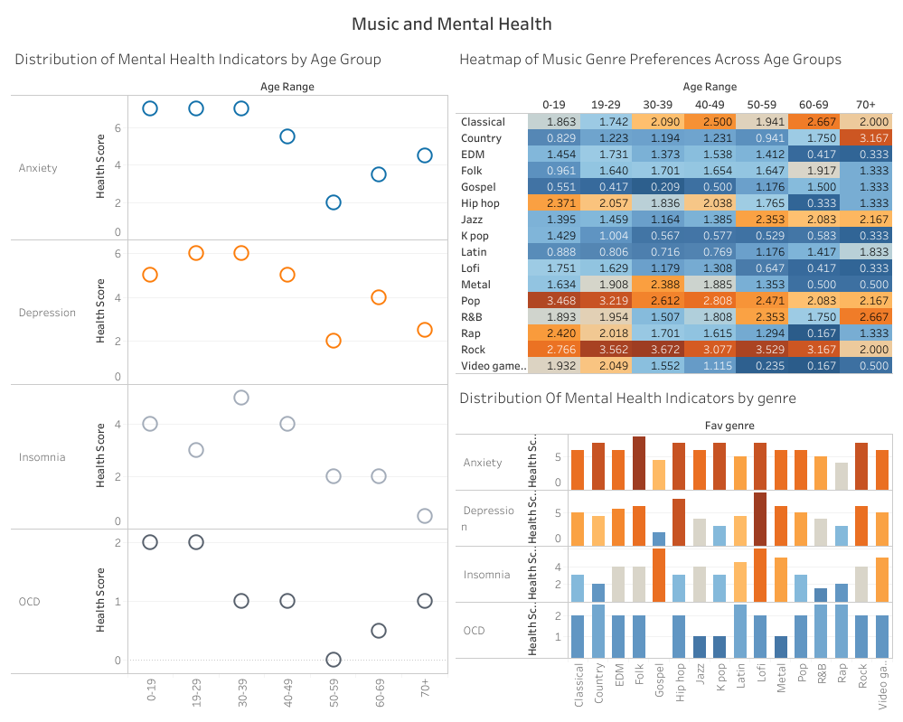

# Final Project: Project 1: Music and Mental Health Data Analysis

This case study explores the relationship between music preferences and mental well-being. In today's society, mental health challenges are increasingly prevalent, particularly among young adults. Understanding the factors that contribute to mental well-being is crucial for developing effective support systems and interventions. This study investigates whether musical taste might offer insights into an individual's mental state.

Specifically, it examines:

*   The correlation between preferred music genres
*   Listening habits (hours per day, BPM preference)
*   Various mental health indicators, including anxiety, depression, insomnia, and obsessive-compulsive disorder (OCD).

This research is relevant to the real-world challenge of identifying accessible and personalized approaches to mental health support. While clinical interventions are essential, exploring lifestyle factors like music preferences could offer valuable complementary strategies. For example, if certain musical preferences are found to be associated with lower levels of anxiety, this information could be used to promote music listening as a self-care tool.

This study analyzes data collected from Kaggle. It is assumed that the self-reported mental health scores provide a reasonable, though not definitive, measure of mental well-being. It is also assumed that individuals' reported music preferences accurately reflect their typical listening habits. The study acknowledges the limitations of correlational research, recognizing that observed associations do not necessarily imply causal relationships.

## Data Cleaning and Preprocessing

This chapter describes the data cleaning and preprocessing steps performed in Excel to prepare the data for analysis.

### Excel Cleaning and Preprocessing

The raw data from the Kaggle dataset required cleaning and preprocessing before analysis. The following steps were taken in Excel:

1.  **Handling Empty Rows:** Empty rows were identified in the "BPM," "Age," and "Music Effect" columns and etc. These rows were likely due to missing or incomplete survey responses.  These rows were removed from the dataset using Excel's filtering functionality.  Specifically, the data was filtered to show only rows with blank values in these columns, and then these filtered rows were deleted.

2.  **Trimming Spaces:** Leading and trailing spaces were removed from all text columns using Excel's `TRIM` function.

3.  **Age Range Creation:** The "Age Range" column was created using Excel formulas to categorize respondents into age groups.

4.  **Categorical Variable Encoding:** The "Genre" columns, which contained categorical data (e.g., "Sometimes," "Rarely," etc.), was converted to a numerical representation. "Sometimes" was assigned a value of 1, "Rarely" was assigned a value of 2, and so on. Similarly, the columns as composer, instrumentalist, while working and etc were converted to 1/0 values instead of yes/no values.

5. Checked data for outliers but have not found any.
## Problems:

The primary challenge addressed by this study is to determine if and how musical preferences and listening habits correlate with mental health indicators.

To analyze this problem, several key questions were investigated:

*   **Genre Preference and Mental Health:** Do individuals who prefer certain music genres exhibit different levels of anxiety, depression, insomnia, or OCD?
*   **Music Preference Across Age Groups:** How do music preferences vary across different age groups?
*   **Age and Mental Health:** Is there a relationship between age and mental health indicators?
*   **Music Tempo (BPM) and Mental Health:** Is there a link between preferred music tempo and mental health?
*   **Listening Habits and Mental Health:** Do music listening habits (hours per day) correlate with mental health?

## Methodology

This study employed a mixed-methods approach, combining SQL analysis using BigQuery and data visualization using Tableau.  The following steps were undertaken:

1.  **Data Preparation:** The raw data from the Kaggle dataset was cleaned and preprocessed in Excel, as described in the "Data Cleaning and Preprocessing" chapter.

2.  **SQL Analysis (BigQuery):** SQL queries were written and executed in BigQuery to extract, transform, and aggregate the data for analysis.

    *   Queries were developed to calculate average mental health scores (anxiety, depression, insomnia, OCD) by preferred music genre. (See `sql/mental_health_indicators_across_age_and_genre.sql`)
    *   Further analysis explored music preferences across different age groups. (See `sql/music_preferences_across_age_group.sql`)
    *   The relationship between preferred music tempo (BPM) and mental health indicators was investigated. (See `sql/bpm_across_mental_health_indicators.sql`)
    *   Music listening habits (hours per day) were analyzed in relation to mental health scores. (See `sql/listening_hours_across_mental_health_indicators.sql`)

3.  **Data Visualization (Tableau):** The cleaned data from Google Sheets was visualized using Tableau to explore patterns and trends.

    *   Bar charts were created to compare average mental health scores across different music genres. (See `tableau/genre_by_age.png`)
    *   Heatmaps were used to visualize music genre preferences by age range. (See `tableau/heatmap_by_age_and_genre.png`)
    *   Box plots were generated to analyze the distribution of mental health scores across age groups. (See `tableau/age_by_mental_health.png`)
    *   Bar chart to explore the relationship between music tempo (BPM) and mental health. (See `tableau/bpm_by_age.png`)
    *   Visualizations were created to examine the correlation between music listening habits and mental health. (See `tableau/listening_hours_by_age.png`)

Several interactive elements and advanced Tableau features were utilized to enhance the dashboards. Specifically:

*   **Calculated Fields:** Calculated fields were created to categorize BPM (e.g., "Slow," "Medium," "Fast") and listening hours (e.g., "<1 hour," "1-4 hours," ">4 hours") to facilitate analysis and visualization of these variables.
*   **Color Palette:** A color-blind-friendly color palette was used to ensure accessibility and clarity of the visualizations.

## Analysis and Findings:

**Genre Preference and Mental Health:** **Genre Preference and Mental Health:**

Analysis of the data reveals potential associations between preferred music genre and reported mental health indicators (Anxiety, Depression, Insomnia, and OCD). Several trends are observed:

*   **Folk Music and Anxiety:** Individuals who prefer folk music tend to report higher anxiety scores. The median anxiety score for folk music listeners was 8 compared to 4.0 for rap music listeners.
*   **Lofi Music and Depression/Insomnia:**  Lofi music preference is associated with higher reported levels of both depression and insomnia. The median depression score for Lofi listeners was 8.0 compared to 3.0 for K-pop and R&B listeners.
*   **Gospel Music and Insomnia:** Gospel music preference also shows a trend of higher reported insomnia. The median insomnia score for Gospel listeners was 6.0 compared to 3.0 for classical listeners.
*   **Rock Music and Anxiety/Depression:** Rock music preference is also associated with higher anxiety and depression scores. The median anxiety score for rock listeners was 7.0 compared to 5.0 for classical music listeners.

It is important to note that other genres, such as Classical and some others, show trends toward lower scores on some of the mental health indicators.  However, these trends should be interpreted with caution.

These findings suggest a potential link between musical taste and self-reported mental well-being. However, further research is needed to explore the underlying mechanisms and determine whether these associations reflect a causal relationship or are influenced by other factors. 

<figure>
  
  <figcaption>Figure 1: Mental Health Scores by Preferred Music Genre</figcaption>
</figure>

**Music Preference Across Age Groups:** The analysis of music preference across age groups used data on both favorite genre and average genre ratings. While rock was a popular favorite across age ranges, pop had high average ratings, especially among younger listeners (0-19). Classical music showed steady appreciation (high average ratings) across ages, even if not often chosen as a favorite. For example, in the 19-29 group, rock was the top favorite, but pop had a higher average rating, suggesting broader appeal.The analysis of music preference across age groups used data on both favorite genre and average genre ratings. While rock was a popular favorite across age ranges, pop had high average ratings, especially among younger listeners (0-19). Classical music showed steady appreciation (high average ratings) across ages, even if not often chosen as a favorite. For example, in the 19-29 group, rock was the top favorite, but pop had a higher average rating, suggesting broader appeal. 

<figure>
  
  <figcaption>Figure 2: Heatmap of music genre preference by age range.</figcaption>
</figure> 

These findings suggest that favorite genre and average rating capture different aspects of preference. While favorite highlights top choices, average rating reveals broader appreciation. Further analysis could explore these nuances and the influence of other factors.

**Age and Mental Health:** The relationship between age and mental health was explored using grouped box plots.

<figure>
  
  <figcaption>Figure 3: Grouped box plots showing median anxiety and depression scores by age range.</figcaption>
</figure>

 Median anxiety and depression scores were highest in younger adults (19-29) and gradually decreased across older age groups. Insomnia scores peaked in the 30-39 age range before declining. OCD scores were highest in the youngest age groups (0-19 and 19-29). These findings suggest that mental health challenges, particularly anxiety and depression, may be more prevalent in younger populations.

**Music Tempo (BPM) and Mental Health:** Analysis of preferred music tempo (BPM) and mental health revealed a potential link between moderate BPM and lower anxiety. Individuals preferring music in the 61-120 BPM range tended to report lower average anxiety scores compared to those preferring slower or faster tempos. While other mental health indicators showed similar trends, the difference was most pronounced for anxiety.

<figure>
    <figcaption>Figure 4: Average scores by BPM category.</figcaption>
</figure>

**Listening Habits and Mental Health:** Exploratory analysis of music listening habits and mental health indicators revealed potential associations. While individuals listening for less than 1 hour per day tended to report lower scores across OCD, insomnia, depression, and anxiety, those listening for more than 4 hours showed somewhat higher average scores, particularly for OCD. Further research is needed to investigate these trends.

<figure>
  
  <figcaption>Figure 5: Average anxiety scores by listening category.</figcaption>
</figure>

The interactive dashboard can be viewed online at: [Tableau Public Link](https://public.tableau.com/views/PublicandMentalHealthWorkbook/Dashboard1?:language=en-US&:sid=&:redirect=auth&:display_count=n&:origin=viz_share_link)

<figure>
  
  <figcaption>Figure 6: Music and Mental Health Dashboard.</figcaption>
</figure>

It is important to note that these findings represent correlations and do not establish causal relationships. Further research is needed to explore the underlying mechanisms that might explain these observed associations.

## Solutions:

Based on the analysis of the data, several potential solutions can be considered to address the observed relationships between music and mental well-being. It's important to emphasize that these are potential solutions for promoting mental well-being rather than treating mental health conditions, which require professional clinical intervention.

**Solution 1: Personalized Music Recommendations for Mental Well-being:**

*   **Description:** Develop a system (e.g., a mobile app or a feature within existing music streaming platforms) that uses user-provided mental health information (e.g., self-reported anxiety levels, mood) and music preferences to generate personalized playlists designed to promote relaxation, reduce stress, or improve mood.
*   **Pros:** Accessible, personalized, and potentially empowering for users. Could be integrated into existing technology.
*   **Cons:** Relies on self-reporting, which can be subjective. Requires careful design to avoid unintended consequences (e.g., recommending music that might trigger negative emotions). Ethical considerations regarding data privacy.

**Solution 2: Music-Based Interventions in Community Settings:**

*   **Description:** Implement music-based activities in community centers, schools, or workplaces. These could include guided listening sessions, group singing, or music therapy workshops led by qualified professionals.
*   **Pros:** Provides social support and a sense of community.
*   **Cons:** Requires resources (funding, trained facilitators). May not be accessible to everyone.

**Solution 3: Public Awareness Campaigns:**

*   **Description:** Launch public awareness campaigns to educate people about the potential benefits of music for mental well-being. These campaigns could include social media content, educational materials, and partnerships with mental health organizations.
*   **Pros:** Can reach a large audience and raise awareness about the topic.
*   **Cons:** May not lead to direct action. Requires careful messaging to avoid oversimplifying the complex relationship between music and mental health.

**Solution 4: Further Investigation:**

Let's say we know which music user prefers. Let's investigate further. Is there any particular note that destresses users? Is there any particular frequency that helps to prevent against despite of the music genre? Could we maybe create an app only based on frequency or note which is beneficial for the user?

## Conclusion:

This study explored the relationship between music preferences, listening habits, and mental well-being.  Our analysis revealed correlations suggesting that preferences for certain genres (e.g., Folk, Lofi, Rock) are associated with higher reported levels of some mental health indicators, while others (e.g., Classical, Gospel) show trends toward lower scores.  We also observed potential links between listening habits, BPM preferences, and mental well-being.  Crucially, these are correlations, not causal relationships.  Further research is needed to explore these complex interactions and determine the influence of other factors.  

## Next Steps:

Based on the analysis and the evaluation of potential solutions, the recommended approach is to develop a personalized music recommendation system (Solution 1). This solution offers the greatest potential for accessibility, personalization, and scalability.

**Specific Recommendations:**

*   **Develop a Prototype:** A team of software developers, music experts, and mental health professionals should collaborate to create a prototype of the recommendation system.
*   **User Testing:** Conduct user testing with a diverse group of participants to evaluate the system's effectiveness and identify any areas for improvement. Pay close attention to user feedback regarding the relevance of music recommendations and any potential emotional triggers.
*   **Data Privacy and Ethics:** Establish clear guidelines for data privacy and ethical considerations such as HIPAA or GDPR. Ensure that user data is collected and used responsibly and transparently.
*   **Partnerships:** Explore partnerships with existing music streaming platforms or mental health organizations to integrate the recommendation system into existing