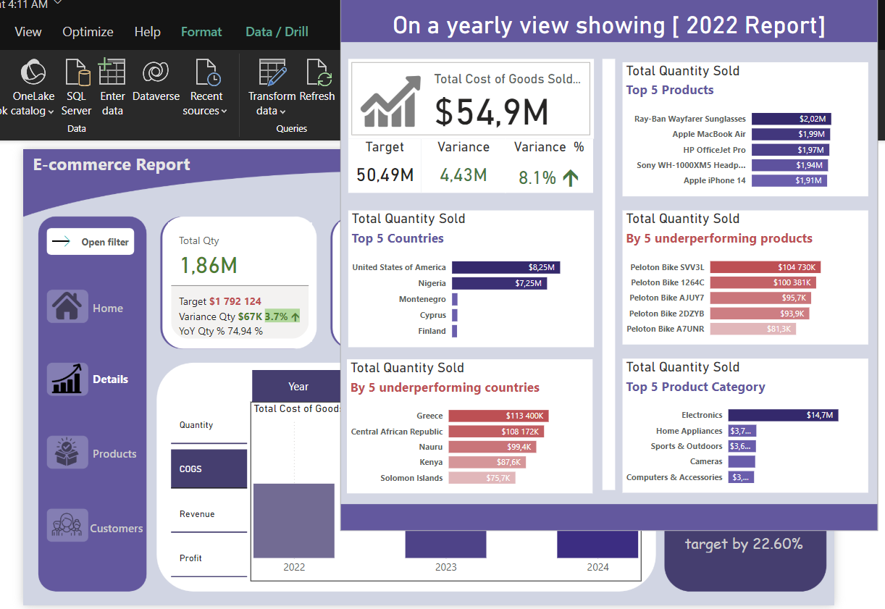

# Business Performance Report

This report compares the **current month's** performance with the **previous month's** data to help management understand how the business is performing. Key metrics such as **Net Revenue**, **Profit**, and **Profit Margin** are analyzed, with a special focus on the target **profit margin of 55%**.

The data insights highlight how the **profit margin** compares to the target.

Key sections of the report include:
- **Total Quantity**
- **Net Revenue**: Comparison of the current and previous month's revenue.
- **COGS**: Total Cost of Goods
- **Profit**: Analysis of profit changes.
- **Profit Margin**: A check against the 55% target and the performance of the current month.

### Links to Visuals and Dashboards:
###

- [Download the entire project](first_dash.pbix)

