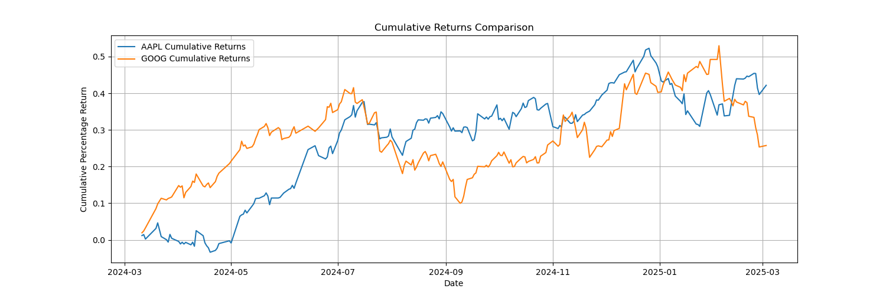
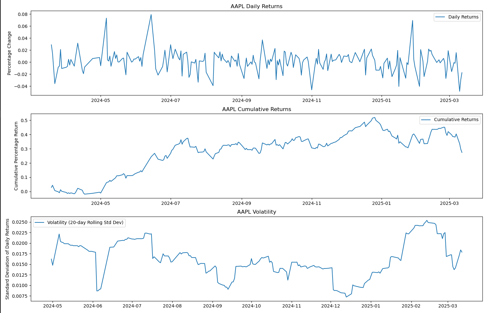
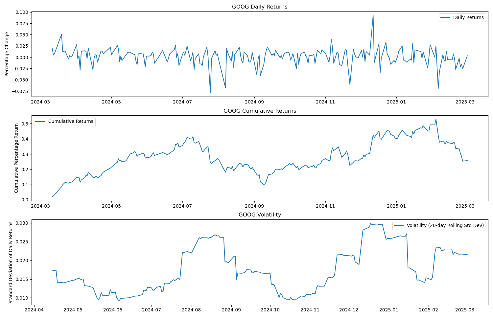

## Stock Performance Analysis Report

**Introduction:**

This report analyzes the historical stock performance of user-specified tickers, focusing on daily returns, volatility, and cumulative returns. The goal is to provide insights for potential investment considerations.

**Data Acquisition and Cleaning:**

1.  **User Input:** Users provide up to four stock tickers.
2.  **Data Retrieval:** Historical stock data is downloaded from Yahoo Finance (yfinance) for a 1-year period using `yf.download()`, saved as CSV files, and loaded into Pandas DataFrames.
3.  **Data Cleaning:**
    * Data is transformed from a wide to long format using `stack()` and index adjustments.
    * Duplicates and erroneous header rows are removed.
    * Missing values are removed.
    * Range checks and outlier handling are performed.
    * Dates are converted to datetime objects.
4.  **Analysis:** Daily returns, cumulative returns, and volatility (20-day rolling standard deviation) are calculated.

**Methodology:**

Stock data is acquired, cleaned, and analyzed to compare performance based on daily returns, cumulative returns, and volatility.

**How to run it**

Just run `python3 main.py` command in your terminal and follow the instructions.

**Plotting and Visualization:**

* Adjusted close prices, daily returns, cumulative returns, and volatility are plotted.
* Cumulative returns are also shown in an overlay plot for direct comparison.
* Plots include clear Y-axis labels.

**Results:**

Based on user input the following stocks were analysed.

* **Best Performing Stock:** AAPL (cumulative return: 42.11%)

* **Performance Comparison:**
    * **AAPL:** Average Daily Return: 0.18%, Volatility: 1.66%
    
    * **GOOG:** Average Daily Return: 0.12%, Volatility: 1.84%
    

**Summary Statistics:**

| Ticker | Average Daily Return | Volatility | Final Cumulative Return |
| :----- | :-------------------- | :--------- | :---------------------- |
| AAPL   | 0.001795              | 0.016164   | 0.421116                |
| GOOG   | 0.001239              | 0.017431   | 0.254399                |

**Analysis and Interpretation:**

AAPL outperformed GOOG with higher cumulative returns and lower volatility.

**Important Considerations:**

* Past performance is not indicative of future results.
* Risk tolerance and time period are important factors.
* This analysis is flexible for user-defined tickers.

**Conclusion:**

AAPL showed superior performance. However, investment decisions should be based on thorough research and individual goals.

**Recommendations:**

* Further analysis with additional metrics (Sharpe ratio, etc.).
* Incorporate technical indicators and moving averages.
* Expand analysis to more stocks and asset classes.
* Add volume analysis.
* Users should conduct their own research.